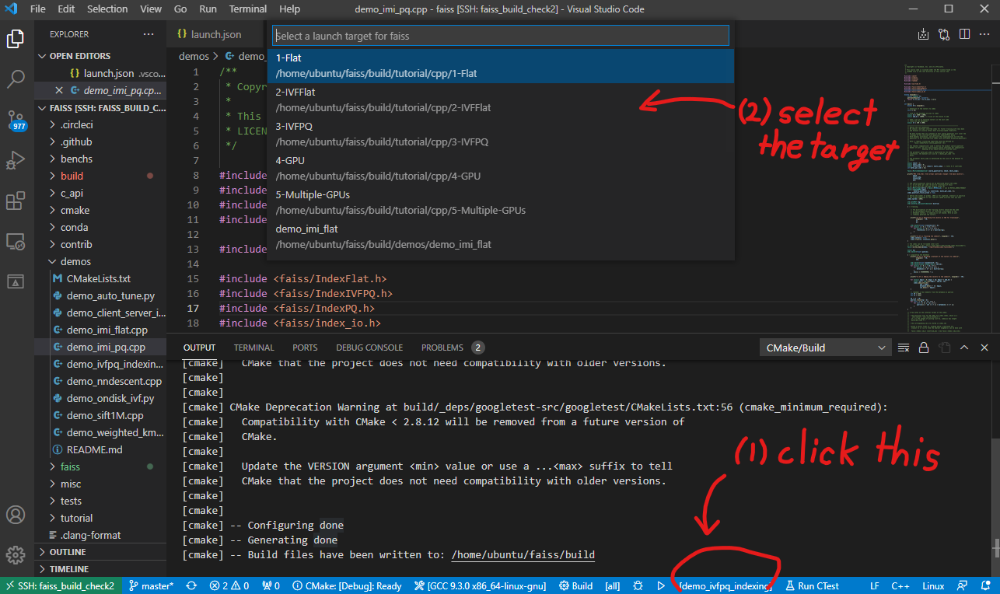
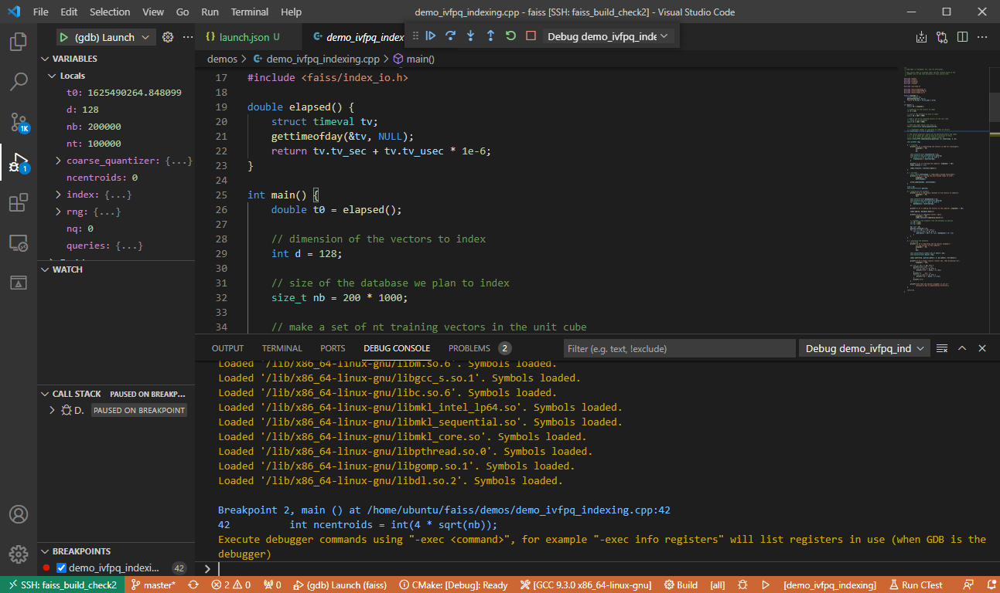

# Develop
- We assume that you've [already installed faiss](build.md)

## How to add your class
Let's write your own index, build the library with it, and use it in python. Here, we will add `IndexHello` class, which is inherited from `IndexFlatL2` class but with `hello` function.

Add the following file as `IndexHello.h` at `$HOME/faiss/faiss`.
```c++
#ifndef FAISS_INDEX_Hello_H
#define FAISS_INDEX_Hello_H

#include <faiss/IndexFlat.h>

namespace faiss {

struct IndexHello : IndexFlatL2 {
    explicit IndexHello(int d) : IndexFlatL2(d) {}
    IndexHello() {}
    void hello();
};

} // namespace faiss

#endif

```

and the following as `IndexHello.cpp`.

```c++
#include <faiss/IndexHello.h>

namespace faiss {

void IndexHello::hello() {
    printf("Hello!\n");
}

} // namespace faiss
```

Then, please edit `$HOME/faiss/faiss/CMakeLists.txt`.
You should add two lines:
- `IndexHello.cpp` at the `set(FAISS_SRC ...` block.
- `IndexHello.h` at the `set(FAISS_HEADERS ...` block.

That's all. You can build the faiss again.
```bash
make -C build -j faiss_avx2
```
Note that we build `faiss_avx2` only since that's all we use.

## Run your class in c++
The easiest way to make sure `IndexHello` works is to add a script in the demos directory.

Save the following file as `demo_hello.cpp` at `$HOME/demos`.
```c++
#include <faiss/IndexHello.h>

int main() {
    faiss::IndexHello index(100);
    index.hello();
    return 0;
}
```
Then append the following lines at `$HOME/demos/CMakeLists.txt`.
```bash
add_executable(demo_hello EXCLUDE_FROM_ALL demo_hello.cpp)
target_link_libraries(demo_hello PRIVATE faiss_avx2)
```

Then build and run it.
```bash
make -C build -j demo_hello
./build/demos/demo_hello
```
You can obtain the result:
```console
Hello!
```

## Run your class in python
To use your class inside python, you need to update the following lines on `$HOME/faiss/python/swigfaiss.swig`. Because we inherit `IndexPQ` this time, it would be clear to write the line after the counterpart of `IndexPQ`.
- Add `#include <faiss/IndexHello.h>` after `#include <faiss/IndexPQ.h>`
- Add `%include  <faiss/IndexHello.h>` after `%include  <faiss/IndexPQ.h>`
- Add `DOWNCAST ( IndexHello )` after `DOWNCAST ( IndexPQ )`. Note that this addition depends on the inheritance of your class.

Let's build it.
```bash
make -C build -j swigfaiss_avx2
cd build/faiss/python
python setup.py install
```
Note that:
- If you build `swigfass_avx2`, it automatically build `faiss_avx2` as well. So you don't need to explicitly run `make -C build -j faiss_avx2`
- `swigfaiss.swig` is automatically copied to `swigfaiss_avx2.swig`. 

After that, you can use your class in python. 
Save the following script as `check.py`.
```python
import faiss
import numpy as np

D = 128
N = 1000
X = np.random.random((N, D)).astype(np.float32)

index = faiss.IndexHello(D)
index.add(X)
dist, ids = index.search(x=X[:3], k=5)
print(dist)
print(ids)

index.hello()
```

Run it by `python check.py`, then you'll obtain the result.
```console
[[ 0.        16.569878  16.886839  17.121437  17.430017 ]
 [ 0.        15.254007  15.329275  15.539896  15.809263 ]
 [ 0.        15.9044075 15.939333  16.18483   16.36927  ]]
[[  0 197 443 254 571]
 [  1 742 293 532 204]
 [  2 350 554 788 742]]
Hello!
```


## Debug

Here, I will introduce how to debug the c++ files. Especially,
I focus the files in the `demos` directory.
It is because they are already under the cmake managament, thus easy to debug.

In summary what we need to do is:
- Follow the official tutorial of [CMake Tools on Linux for vscode](https://code.visualstudio.com/docs/cpp/cmake-linux)
- Leverage the official [launch.json](https://vector-of-bool.github.io/docs/vscode-cmake-tools/debugging.html#debugging-with-cmake-tools-and-launch-json) of CMake Tools


First, install gdb:
```bash
sudo apt install gdb
```

Create launch.json.
```bash
cd $HOME/faiss
mkdir .vscode/
touch .vscode/launch.json
```
Then copy [this](https://vector-of-bool.github.io/docs/vscode-cmake-tools/debugging.html#debugging-with-cmake-tools-and-launch-json) to the `launch.json`.


Open the faiss directory (`$HOME/faiss`) by vscode. Install [C/C++ extension](https://marketplace.visualstudio.com/items?itemName=ms-vscode.cpptools) and [CMake Tools](https://marketplace.visualstudio.com/items?itemName=ms-vscode.cmake-tools).

You first need to specify your compiler. Open the Command Palette (`Ctrl+Shift+P`), and run the **CMake: Select a Kit**. Select the g++ that you used to build faiss.

You then need to select the variant (Debug or Release). Open the Command Palette again and run the **CMake: Select Variant**. Select **Debug**.

Then, run the cmake again in the terminal of vscode.
```bash
cmake -B build \
    -DBUILD_SHARED_LIBS=ON \
    -DBUILD_TESTING=ON \
    -DFAISS_OPT_LEVEL=avx2 \
    -DFAISS_ENABLE_GPU=OFF \
    -DFAISS_ENABLE_PYTHON=$HOME/miniconda/bin/python \
    -DCMAKE_BUILD_TYPE=Release .
```
(I'm not sure why we need this process, but it seems that we need to manually specify `build/CMakeCache.txt`)


Open the Command Palette and run the **CMake: Configure**.

Open the Command Palette and run the **CMake: Build**. 

Now you can select the build target at the bottom of the windows. Then select the file you want to debug. 



Open the Command Palette and run the **CMake: Debug** (or, press `CTRL+F5`, or, click the bug button at the bottom of the window), then you can debug it.

